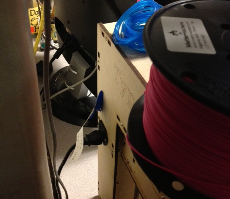
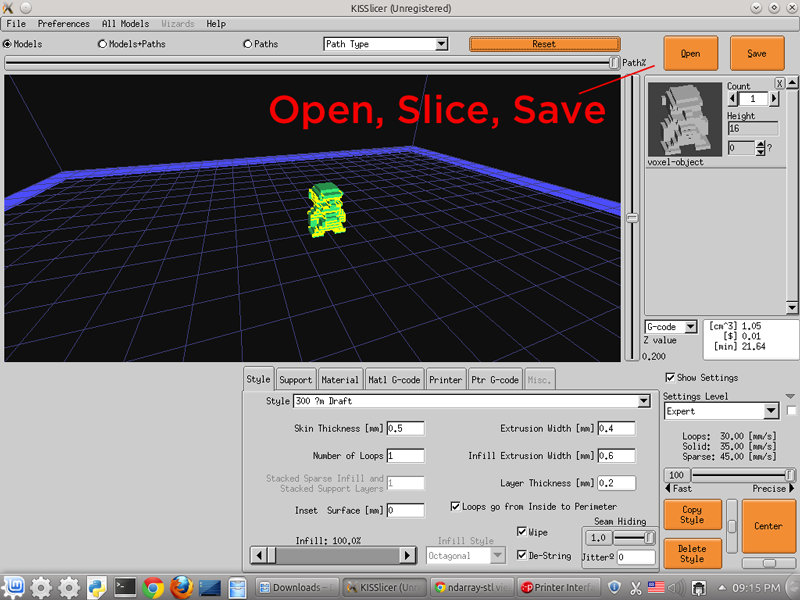
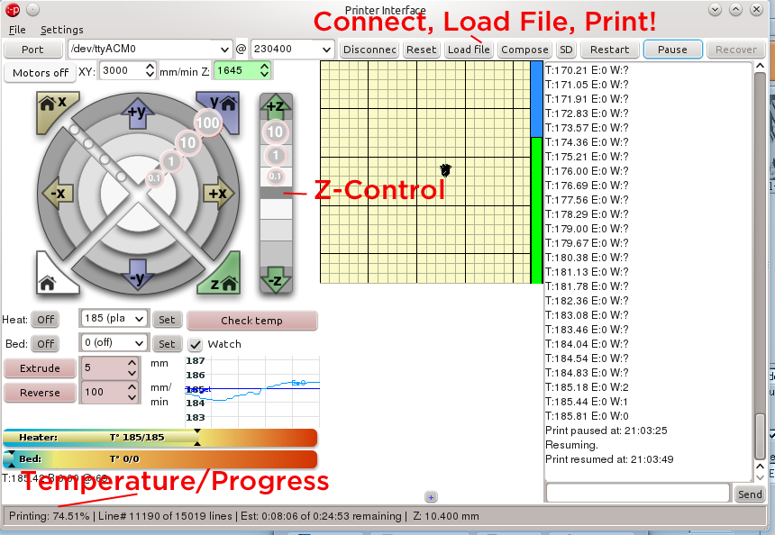
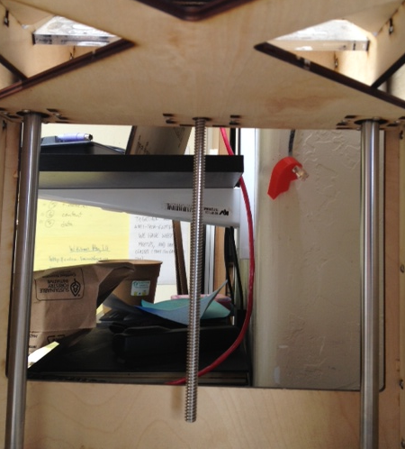
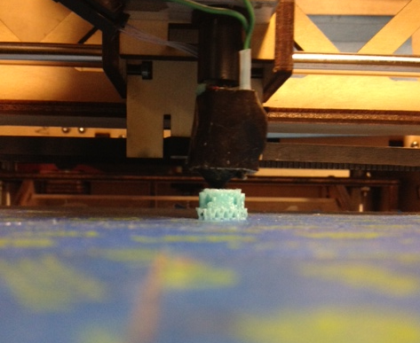
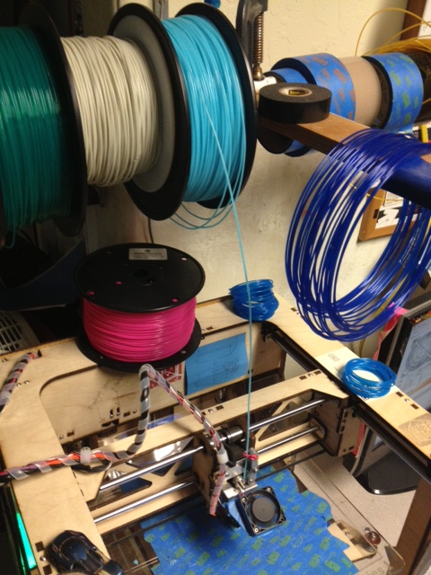

# SudoRoom 3D Printing

3D Printing models, projects and more from Oakland's SudoRoom

https://sudoroom.org/wiki/3DPrinting (the instructions on the wiki are currently out of date)

# How to print!

We have a [Type A Machines](http://www.typeamachines.com/) Series 1 printer and a Linux desktop running KDE that is attached to it. Anyone can use these to print! You can also use your own computer if you need to, get the software at the Type A Machines [downloads page](http://www.typeamachines.com/pages/downloads)

### Turn on the printer

The power switch is on the back.

### Get a 3D model

Try to get your 3D model as an `.stl` format. It also helps if the model looks printable e.g. if right-side up pyramids print very well, but upside-down pyramids don't print very well because the 3D printer can't very easily print things floationg in air with no supports.

A good place to find 3D models is http://www.thingiverse.com/.

### Slice your model

Open up the program called KISS Slicer and load your STL file into it. This program takes the model and 'slices' it up into a path for the printer head to take. It saves a file in the `.gcode` format.

### Print your gcode

Open up the program called Pronterface, connect to the printer and then load your `.gcode` file.

If you have problems connecting make sure the printer is turned on, plugged in via USB and that the baud rate is set to 230400 on a TTY (or possibly CU) device.

Some things to be aware of:

- You can pause the print from Pronterface and then manually adjust the bed height. If it looks like the print head is smashing down too hard on the print surface your print will be lower quality, but it also will be lower quality if it is too high off of the print surface.

To adjust the bed height, pause the print and then click the 'Motors off' button. Then with your hands reach below the print platform and turn the threaded metal corkscrew thingy in the back until the print head looks flush with the printing surface (guesstimate, and adjust).

- Keep an eye on the temperature. If something gets clogged or stuck the print head could overheat and the printer could get damaged, but if you keep an eye on it you can stop the print from Pronterface before the head has time to overheat. The temperature should be between 170-200 during a print.

- Make sure the plastic spools don't get stuck and pop out of the print head. Keep the pipes a flowin! If the print head gets clogged either ask for help declogging or stick a fine wire up the end of the print head while its heated up to see if you can get it to flow. There is a manual "Extrude" button in Pronterface that will push out a little bit of plastic at a time.

Have fun!
